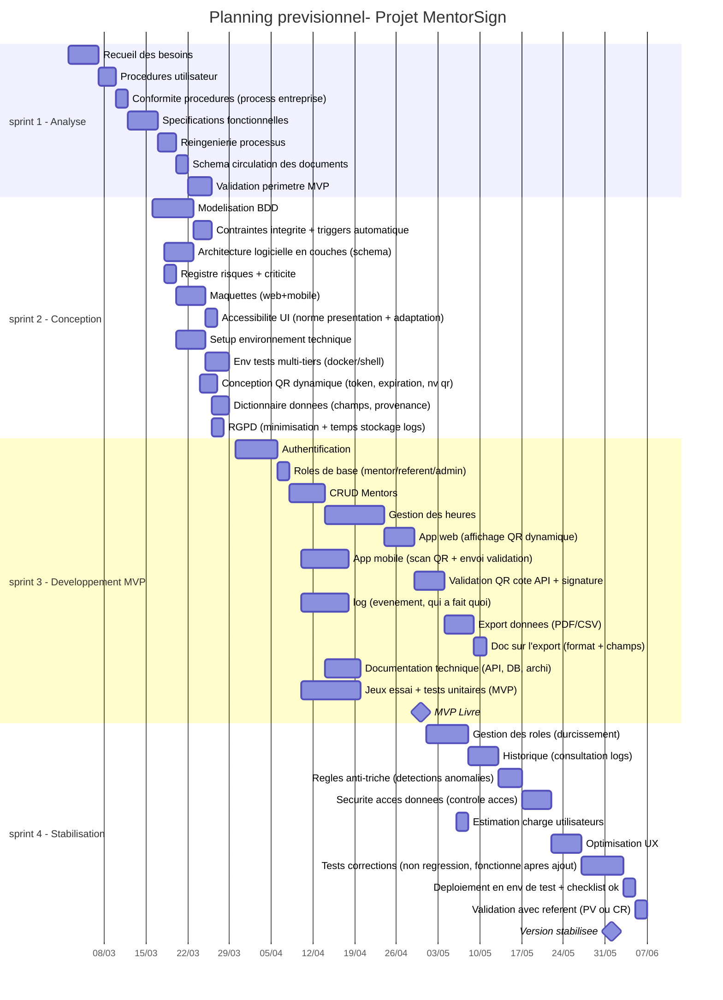

**Nom projet :** MentorSign
**Date de début :** 02/03/2026
Taux réelle de disponibilité : J'ai un rythme d'alternance de 2 semaines en entreprise/1 semaine en cours. Pendant mes semaines en entreprise, soit 35h sur 5 jours, je peux passer en moyenne 15h à 20h par semaine sur cette mission (répartition selon les autres missions et interventions). Sur mes semaines de cours, j'estime qu'en dehors de mes cours je peux passer en moyenne 10h par semaine sur le projet.

Ce qui porte le temps passé sur le projet à : 17 h + 17 h + 10 h = 44h sur 3 semaines en moyenne.

**Expérience vécue  :** Cette estimation est basée sur mon rythme habituel pour réaliser ce type de fonctionnalités (CRUD, authentification, API, base de donnée, front end, back end) et sur l’expérience de projets précédents. 
Ses estimations seront ajustées au fil des sprints via les comptes-rendus d’activités et la mise à jour du planning. 
**Anticipation :** J'ai pris en compte une marge dédiée à la correction, aux retours et à l’ajustement des spécifications.

